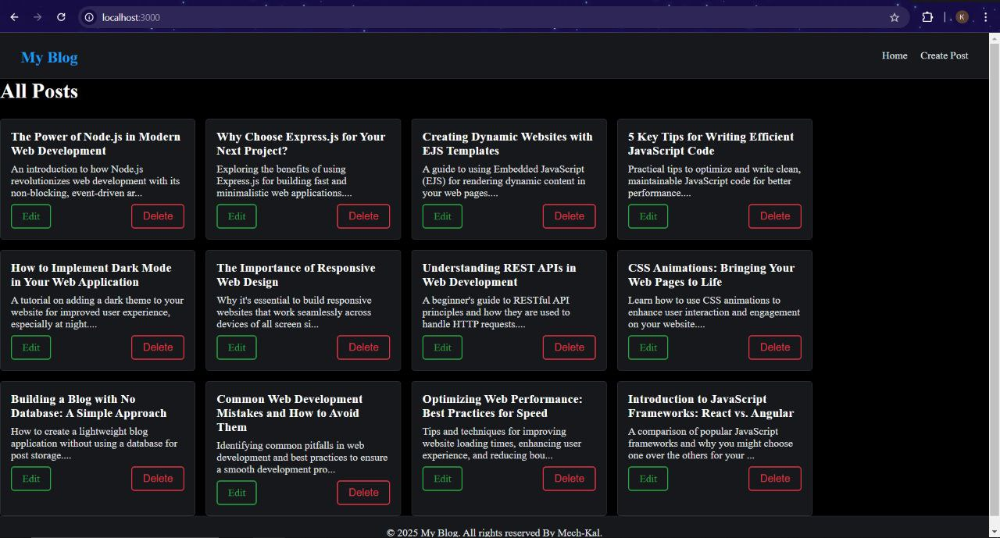

# Dynamic Blog Application

## Project Overview
This is a simple, dynamic blog application built using **Node.js**, **Express.js**, and **EJS**. It allows users to create, edit, and delete blog posts, all while enjoying a responsive dark-themed user interface. This project focuses on implementing the fundamentals of server-side rendering and web development with clean design and user-friendly interactions.

---

## Features
- Create, edit, and delete blog posts.
- Responsive dark theme design.
- Interactive hover and click animations on buttons.
- Modular structure using reusable components like header and footer.
- Simple and lightweight without a database (posts do not persist).

---

## Technologies Used
- **Backend**: Node.js, Express.js
- **Templating Engine**: EJS
- **Styling**: CSS with animations and a dark theme
- **Tools**: Method-override for handling PUT and DELETE requests

---

## Getting Started

### Prerequisites
- Install [Node.js](https://nodejs.org/) on your system.

### Setup Instructions
1. Clone this repository:
   ```bash
   git clone https://github.com/mech-kal/blog-app.git


### ProjectStructure
project-folder/
├── views/
│   ├── header.ejs       # Shared header component
│   ├── footer.ejs       # Shared footer component
│   ├── index.ejs        # Home page displaying all posts
│   ├── create.ejs       # Page for creating new posts
│   ├── edit.ejs         # Page for editing posts
├── public/
│   ├── css/
│       ├── style.css    # Stylesheet for the application
├── app.js               # Main server file
├── package.json         # Project dependencies and scripts
├── README.md            # Project documentation


### screenshots



